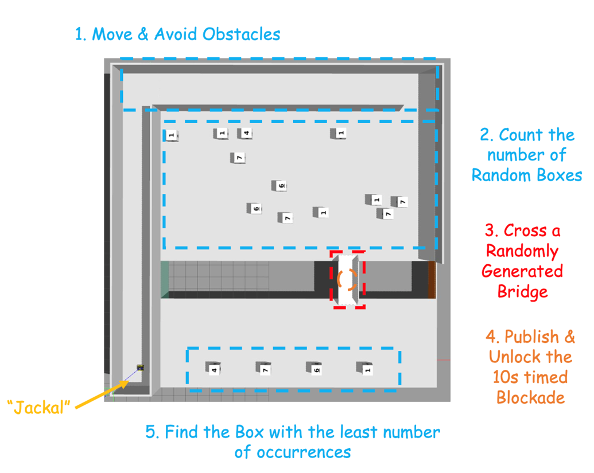

# AutoNaviTask
 This repo is for ME5413 Autonomous Mobile Robotics @NUS Advanced Robotics Center (ARC)

Members: Haozheng, Sihan, Zaishu, Xingjian, Haoze, Yile

## Task Overview



Detailed requirements are as listed under: [NUS-Advanced-Robotics-Centre/ME5413_Final_Project: NUS ME5413 Autonomous Mobile Robotics Final Project](https://github.com/NUS-Advanced-Robotics-Centre/ME5413_Final_Project)

Kindly follow installation steps :-)

## Requirements

see requirements.txt

```
pip install -r requirements.txt
rosdep install --from-paths src --ignore-src -r -y
```

Note that ROS related dependencies are not recommended to be installed by pip.

## Running

```bat
# If you encounter errors you can't not address, please try to exit your conda environment first.

cd
git clone https://github.com/SinyZXJ/AutoNaviTask.git
cd AutoNaviTask-main

rosdep install --from-paths src --ignore-src -r -y

# You may not have access to devel & build, please delete the 2 directories and run following commands.
catkin_make
source devel/setup.bash

# Terminal1:
conda deactivate # if you set conda as default environment
source devel/setup.bash
roslaunch me5413_world world.launch

#Terminal2:
conda deactivate # if you set conda as default environment
source devel/setup.bash
roslaunch me5413_world navigation.launch

# Terminal3:
cd src/me5413_world
python3 main.py
```

## Contribution

Haozheng - *Step1 Planning + Point Cloud Matching + Navigate to Final Box*

Sihan - *Mapping + Localization*

Zaishu - *Planning (RL Methods & Basic Methods)*

Xingjian - *Planning (RL Methods & Basic Methods) + Slides Making*

Haoze - *Numbers Recognition + Paper Writing*

Yile - *Bridge Recognition + Crossing*
